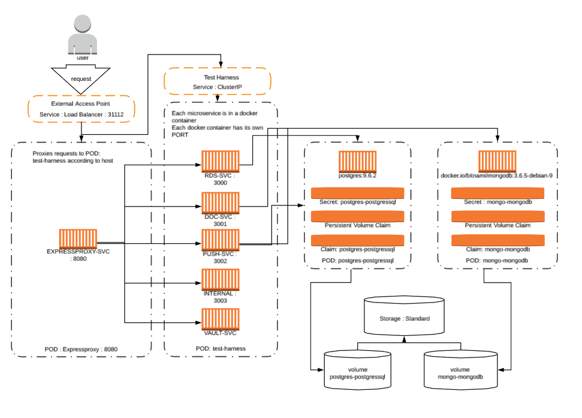

# Setup : Express, Docker & Kubernetes : microservice app
What this app does : 
- routes requests from a mapped host file configuration to the correct microservice.
 - data coming in that is relational goes to the postgresSQL DB
 - data coming in the form of a document is redirected into the mongo database.
 
Example : 
- http://rdstest.com/api/rds/healthcheck : Expressproxy notices the host "rdstest.com" and directs the request to the rds microservice that manipulates the data and saves that data to a relational database. 

## First : Install VirtualBox
We need a virtual environment for our kubernetes minikube. I highly suggest Virtualbox because it is free and works pretty well.  
[download](https://www.virtualbox.org/wiki/Downloads)

## Install home brew then install these apps  
[home brew](https://brew.sh/)  

- install kubectl with home brew
    - `$ brew install kubernetes-cli`
- install minikube with home brew
    - `$ brew cask install minikube`
- install helm with home brew
    - `$ brew install kubernetes-helm`

## Steps : for local environment setup
- `$ minikube start`  
Wait for minikube to start

Once start open the minikube dashboard
- `$ minikube dashboard`

We need all of our docker containers to live inside our minikube environment. Run this to set this up
- `$ eval $(minikube docker-env)`

Rest of the steps will be inside the **k8s/deployments** folder
- `$ sh docker_build_script.sh`

You will need to run the below code to get "tiller" installed on your minikube
- `$ helm init` 

Wait for tiller. Check the kubernetes pods
- `$ kubectl get pods --all-namespaces | grep "tiller"`  
You should see 1/1 Running when it is ready ... Then proceed

- `$ sh setupDbs.sh`  
Make sure you view the terminal and copy the data that was displayed in the terminal so you can update the database endpoints in each microservice. These passswords are set inside a secrete inside our kubernetes cluster. I just need to figure out how to access them inside our express app via environment variables. Till then, do this below
 3. You will need to run : `$ PGPASSWORD=$(kubectl get secret --namespace default postgres-postgressql -o jsonpath="{.data.postgres-password}" | base64 --decode; echo) && echo $PGPASSWORD`
 4. Take the password that is shown in your terminal and update the connection string with the new password.  
   **A**. it would be best to put this password in an environment variable so you do not check this into source control.  
   **Now you are done with postgresSQL connection** 
 5. You will need to do the same thing for mongo.  
    **A**. get password for root mongo user `$  export MONGODB_ROOT_PASSWORD=$(kubectl get secret --namespace default mongo-mongodb -o jsonpath="{.data.mongodb-root-password}" | base64 --decode) && echo $MONGODB_ROOT_PASSWORD`  
    **B**. update connection string in PUSH and DOC with the new password and your monogodb kubernetes service name.

You will need to seed your mongodb and postres db.

Access your postgres db : 
- `$ PGPASSWORD=$(kubectl get secret --namespace default postgres-postgresql -o jsonpath="{.data.postgres-password}" | base64 --decode; echo)`
- `$ kubectl run --namespace default postgres-postgresql-client --restart=Never --rm --tty -i --image postgres \
        --env "PGPASSWORD=$PGPASSWORD" \
        --command -- psql -U postgres \
        -h postgres-postgresql postgres`

Add test data
- `$ CREATE DATABASE push;`
- `$ CREATE DATABASE rds;`
- `$ \connect push;`
- `$ CREATE TABLE test (title varchar(255));`
- `$ INSERT INTO test (title) VALUES ('this is a test for postgres db : push : title');`
- `$ \connect rds`;
- `$ CREATE TABLE test (title varchar(255));`
- `$ INSERT INTO test (title) VALUES ('this is a test for postgres db : rds : title');`
- press `command d` to exit

Access your postgres db : 
- `$ export MONGODB_ROOT_PASSWORD=$(kubectl get secret --namespace default mongo-mongodb -o jsonpath="{.data.mongodb-root-password}" | base64 --decode)`
- `$kubectl run mongo-mongodb-client --rm --tty -i --image bitnami/mongodb --command -- mongo admin --host mongo-mongodb -u root -p $MONGODB_ROOT_PASSWORD`

Add test data
- `$ use doc;`
- `$ db.createCollection('test');`
- `$ db.test.insert({title: 'This is a test for mongo db : doc : title});`
- `$ use push;`
- `$ db.createCollection('test');`
- `$ db.test.insert({title: 'This is a test for mongo db : push : title});`
- press `command d` to exit

Proceed...
- `$ kubectl apply -f ./local/local_deploy.yaml`  
The deployment is using the docker containers from your local environment. 

Next, type this in your terminal and the browser will go to the main page
- `$ minikube service expressproxy-svc`

## Setup hosts file
- Set terminal all the way to the root ... example: `cd && cd ../../../`
- `$ cd etc`
- `$ sudo nano hosts`

Add 
- 192.168.99.100  rdstest.com
- 192.168.99.100  doctest.com
- 192.168.99.100  pushString.com
- 192.168.99.100  pushDoc.com
- 192.168.99.100  internal.com

Note : this IP address can be retrieved from `$ minikube ip`

### Run examples 

#### RDS - Relational Data

- http://rdstest.com:31112/ 
    * base application
- http://rdstest.com:31112/api/rds/3
    * expressproxy service routes to internal IP 3000 on the test-harness pod : rds microservice
    * hard coded JSON response
- http://rdstest.com:31112/api/rds/healthcheck
    * expressproxy service routes to internal IP 3000 on the test-harness pod : rds microservice
    * Access route and queries the *postgres* db and returns data from database
 
NOTE: http://rdstest.com:31112/api/doc/healthchec ... this url does not work due to the incorrect host

#### DOC - Document based Data

- http://doctest.com:31112/ 
    * base application
- http://doctest.com:31112/api/doc/3
    * expressproxy service routes to internal IP 3001 on the test-harness pod: doc microservice
    * hard coded JSON response
- http://doctest.com:31112/api/doc/healthcheck
    * expressproxy service routes to internal IP 3001 on the test-harness pod : doc microservice
    * Access route and queries the *mongo* db and returns data from database
 
NOTE: http://doctest.com:31112/api/rds/healthchec ... this url does not work due to the incorrect host

#### PUSH - Document based Data & Relational Data

- http://pushString.com:31112/ || pushDoc.com
    * base application
- http://pushstring.com:31112/api/push/healthcheck/postgres
    * expressproxy service routes to internal IP 3002 on the test-harness pod : push microservice
    * the service will access the postgres db and return data
- http://pushstring.com:31112/api/push/healthcheck/mongo
    * expressproxy service routes to internal IP 3002 on the test-harness pod : doc microservice
    * Access route and queries the *mongo* db and returns data from database
 
NOTE: http://pushdoc.com:31112/api/rds/healthchec ... this url does not work due to the incorrect host

## Cleanup
If you would like to delete everything and start over
- `$ minikube delete`

If you want to delete all of your docker containers
- `$ docker system prune -a`  
Then choose 'yes'

If you want to delete everything but docker containers.

First : add kubernetes to your bash_profile OR change the below commands from "k" to "kubectl"  
- `alias k=kubectl`
1. Add this to your bash_profile : if you want a quick way to tear down
- `alias kill-testharnes="k delete service test-harness-svc && k delete service expressproxy-svc && k delete deployment test-harness-svc && k delete deployment expressproxy-svc"`

2. If you just want to do this a few times, run this : 
- `$ k delete service test-harness-svc && k delete service expressproxy-svc && k delete deployment test-harness-svc && k delete deployment expressproxy-svc`

